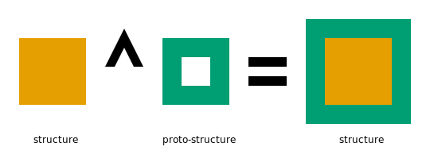

# Defining Structures

A noarr structure is an object that describes the mapping from [indices](Glossary.md#index) to memory.
Noarr provides simple building blocks that can be composed together to define custom structures.

The most trivial building block is Scalar. Scalar itself happens to be a noarr structure.
Written as `scalar<T>()`, it does not need any indices, it only has one element (of type `T`), and its size is a compile-time constant (`sizeof(T)`).


## Defining structures using composition

Most of the mentioned building blocks usually come in the form of proto-structures.
An existing structure can be composed with a proto-structure to form another structure.



In the following example, we compose a `scalar` (a structure) with an `array` (a protostructure), to obtain a new structure.

```cpp
auto channel = noarr::scalar<std::uint8_t>();
auto pixel = channel ^ noarr::array<'c', 3>();
```

The resulting structure is a one-dimensional array. Its only dimension is named `'c'` (for "channel") and has length `3`.
Continuing the example above, we can compose the `pixel` structure again, with another proto-structure, to get yet another structure:

```cpp
auto scanline = pixel ^ noarr::array<'x', 1920>();
auto image = scanline ^ noarr::array<'y', 1080>();
```

Now we have a three-dimensional structure. The dimension names are `'y'`, `'x'` and `'c'`.
The definition of `scanline` could of course be omitted if we only want `image`. Note that `^` is left-associative in C++, so no parentheses are needed either.

```cpp
auto image = pixel ^ noarr::array<'x', 1920>() ^ noarr::array<'y', 1080>();
```

In both definitions, the layout is similar to what one would expect in a raster format.
For example, each pixel and each scanline is stored consecutively, while individual single-pixel columns or individual color components of the image are not.

Array is by far not the only built-in proto-structure. Not all proto-structures add indices (some even remove them) and not and not all proto-structures create a larger structure.
See the overview of [built-in structures and proto-structures](structs/README.md).


## Defining proto-structures using composition

Let's say we want to prepare the grid that can be used with several pixel formats.
What kind of object should `grid` be? It is something that, given a structure (`pixel`), yields another structure (`image`).
In this sense, it is very similar to `array`, except that it adds two dimensions instead of just one.
And like `array`, `grid` will be a proto-structure.

It is possible to define custom proto-structures analogically to custom structures.
Two existing proto-structures can be composed to form another proto-structure.


Our `grid` proto-structure can be defined as a composition of two `array` proto-structures:

```cpp
auto grid = noarr::array<'x', 1920>() ^ noarr::array<'y', 1080>();
```

Now it can be used as any other proto-structure:

```cpp
auto pixel = noarr::scalar<std::uint8_t>() ^ noarr::array<'c', 3>();
auto image = pixel ^ grid;

auto grayscale_pixel = noarr::scalar<std::uint8_t>();
auto grayscale_image = grayscale_pixel ^ grid;

auto transparent_pixel = noarr::scalar<std::uint8_t>() ^ noarr::array<'c', 4>();
auto transparent_image = transparent_pixel ^ grid;

auto hdr_pixel = noarr::scalar<float>() ^ noarr::array<'c', 3>();
auto hdr_image = hdr_pixel ^ grid;
```

Note that there is a slight difference in the definitions of `image` from the [previous section](#defining-structures-using-composition) and the new `image`:

```cpp
// Parentheses emphasize the implicit left-associativity
auto image = (pixel ^ noarr::array<'x', 1920>()) ^ noarr::array<'y', 1080>();

// Parentheses inserted because of the separate definition of `grid`
auto image = pixel ^ (noarr::array<'x', 1920>() ^ noarr::array<'y', 1080>());
```

Although the parenthesization is different, the resulting structure will be exactly the same, including memory layout, order of dimensions, and even C++ type identity.
This makes the `^` operator fully associative.


## Defining structures manually

If a structure cannot be defined using composition, you can implement it as a C++ class. This is how most built-in noarr structures are implemented.

The file defining the structure must include at least `<noarr/structures/base/structs_common.hpp>` (also included by `<noarr/structures.hpp>`).

A structure class must have at least the following public members:

- `signature` member type that
  - is a type alias to a [valid signature](Signature.md)
  - should describe the dimensions accepted in the `state` argument of the remaining members
- `template<IsState State> static constexpr bool has_size() noexcept` and
  `template<IsState State> constexpr auto size(State state) const noexcept`
  - `size` must be defined only when `has_size<State>()` is `true`
  - should return the size of the structure in bytes (as `std::size_t` or `std::integral_constant`)
- `template<IsState State> constexpr auto align(State state) const noexcept`
  - optional; if present should return the alignment requirement in bytes
- `template<class Sub, IsState State> static constexpr bool has_strict_offset_of() noexcept` and
  `template<class Sub, IsState State> constexpr auto strict_offset_of(State state) const noexcept`
  - `strict_offset_of` must be defined only when `has_strict_offset_of<Sub, State>()` is `true`
  - should return the offset of a [sub-structure](Glossary.md#sub-structure) `Sub`
  - is recommended to call `offset_of<Sub>` on one of its sub-structures
- `template<auto QDim, IsState State> static constexpr bool has_length() noexcept` and
  `template<auto QDim, IsState State> constexpr auto length(State state) const noexcept`
  - `length` must be defined only when `has_length<QDim, State>()` is `true`
  - should return the [length](Glossary.md#length) in dimension `QDim`
- `template<class Sub, IsState State> static constexpr bool has_strict_state_at() noexcept` and
  `template<class Sub, IsState State> constexpr auto strict_state_at(State state) const noexcept`
  - `strict_state_at` must be defined only when `has_strict_state_at<Sub, State>()` is `true`
  - should return the result of `state_at<Sub>(struct2, state2)` call, where
    - `struct2` is the same [sub-structure](Glossary.md#sub-structure) that would be queried by `strict_offset_of<Sub>(state)`
    - `state2` is the same argument that would be passed to that sub-structure by `strict_offset_of<Sub>(state)`

All the member functions should fail to compile (either by `static_assert` or substitution failure) when:

- passed an invalid or incomplete state or state referring to nonexistent dimensions
- queried for a nonexistent sub-structure `Sub` or dimension `QDim` (or a sub-structure that just cannot be reached with the current state `s`)
- any additional documented requirements are not met

In the members `strict_offset_of` and `strict_state_at`, the word "strict" refers to the fact that the `Sub` template argument is expected to be strictly a **sub**structure, i.e. never the structure itself.
Note that these two members should not be called directly, but only via `noarr::offset_of` and `noarr::state_at` respectively, which take care of the non-strict case.

If [mangling](other/Mangling.md) support is desired, the structure must additionally:

- be an instance of some template `T`
- inherit from an instance of [`noarr::strict_contain`](dev/Contain.md)
- not define any data members
- define the following public members:
  - `static constexpr char name[]` that
    - either is the qualified identifier of the template `T` (including the leading `::`)
    - or (if `T` is declared in `namespace noarr`) is an unqualified identifier
  - `params` member type that
    - is a type alias to the `noarr::struct_params` instance with the following arguments (corresponding to the actual arguments of the current `T` instance):
      - structure arguments are described using `noarr::structure_param`
      - other type arguments are described using `noarr::type_param`
      - dimension name arguments are described using `noarr::dim_param`
      - non-type arguments are described using `noarr::value_param`
  - all constructors inherited from the base class

Using `strict_contain` is recommended anyway, to avoid having the compiler inserting non-empty unused space in place of empty fields (which is otherwise required by C++).

### Example manual structure definition

You can start with the following template template. It is a structure with one direct sub-structure `T`, one additional dimension `Dim`, and two examples of plain template parameters `U` and `V`.

```cpp
// namespace foo:

template<noarr::IsDim auto Dim, class T, class U, std::size_t V>
struct bar_t : public noarr::strict_contain<T, U> {
	// Inherit constructors
	using noarr::strict_contain<T, U>::strict_contain;

	static constexpr char name[] = "::foo::bar_t";
	using params = noarr::struct_params<
		noarr::dim_param<Dim>,
		noarr::structure_param<T>,
		noarr::type_param<U>,
		noarr::value_param<V>>;

	using signature = ...;

private:
	constexpr T sub_structure() const noexcept {
		// Sub-structure is stored in an inherited field, retrieve it from there
		return noarr::strict_contain<T, U>::template get<0>();
	}

	constexpr U get_u() const noexcept {
		// The U value stored in an inherited field, retrieve it from there
		return noarr::strict_contain<T, U>::template get<1>();
	}

	constexpr auto sub_state(noarr::IsState auto state) const noexcept {
		return ...;
	}
public:
	template<noarr::IsState State>
	static constexpr bool has_size() noexcept {
		return T::template has_size<decltype(std::declval<bar_t>().sub_state(std::declval<State>()))>();
	}

	template<noarr::IsState State>
	constexpr auto size(State state) const noexcept
	requires(has_size<State>())
	{
		auto sub_size = sub_structure().size(sub_state(state));
		return ...; // Could return sub_size if it is the same
	}

	template<noarr::IsState State>
	constexpr auto align(State state) const noexcept
	requires(has_size<State>())
	{
		return sub_structure().align(sub_state(state));
	}

	template<class Sub, noarr::IsState State>
	static constexpr bool has_strict_offset_of() noexcept {
		return noarr::has_offset_of<Sub, T, decltype(std::declval<bar_t>().sub_state(std::declval<State>()))>();
	}

	template<class Sub, noarr::IsState State>
	constexpr auto strict_offset_of(State state) const noexcept
	requires(has_strict_offset_of<Sub, State>())
	{
		auto sub_offset = noarr::offset_of<Sub>(sub_structure(), sub_state(state));
		return ...; // Could return sub_offset if it is the same
	}

	template<auto QDim, noarr::IsState State>
	static constexpr bool has_length() noexcept {
		if constexpr (QDim == Dim)
			return true;
		else
			return T::template has_length<QDim, decltype(std::declval<bar_t>().sub_state(std::declval<State>()))>();
	}

	template<auto QDim, noarr::IsState State>
	constexpr auto length(State state) const noexcept
	requires(has_length<QDim, State>())
	{
		if constexpr(QDim == Dim) {
			// Here we return our own length
			return ...;
		} else {
			// Caller asked somebody else, forward to sub-structure
			return sub_structure().template length<QDim>(sub_state(state));
		}
	}

	template<class Sub, noarr::IsState State>
	static constexpr bool has_strict_state_at() noexcept {
		return noarr::has_state_at<Sub, T, decltype(std::declval<bar_t>().sub_state(std::declval<State>()))>();
	}

	template<class Sub, noarr::IsState State>
	constexpr auto strict_state_at(State state) const noexcept
	requires(has_strict_state_at<Sub, State>())
	{
		return noarr::state_at<Sub>(sub_structure(), sub_state(state));
	}
};
```


## Defining proto-structures manually

Proto-structures usually do not implement any functionality directly. Instead, they often only work as factories for template structures.
When defining a proto-structure manually, you will probably want to define a structure type for it as well.

A proto-structure must have at least the following two members:

- `static constexpr bool proto_preserves_layout` data member
  - evaluates to `true` iff the structure it provides uses exactly the same layout as the original
    (i.e. it delegates calls to `strict_offset_of` and `size`, only updating state, but returning the same value)
- `instantiate_and_construct` const-qualified member function template that
  - can be called as `.instantiate_and_construct(Struct)`, where `Struct` is a structure
  - returns a structure that contains `Struct` as a [sub-structure](Glossary.md#sub-structure) (not necessarily a direct one)

### Example manual proto-structure definition

For example, a proto-structure for the `bar_t` structure shown [above](#example-manual-structure-definition) could look like this:

```cpp
// namespace foo

template<noarr::IsDim auto Dim, class U, std::size_t V> // We need to already know all the template arguments except for the one sub-structure argument
struct bar {
	// We also need to know the values of the fields, again except for the sub-structure
	U u;

	static constexpr bool proto_preserves_layout = true or false;

	template<class Struct>
	constexpr auto instantiate_and_construct(Struct s) const noexcept {
		return bar_t<Dim, Struct, U, V>(s, u);
	}
};
auto pixel = noarr::scalar<int>();
auto proto = bar<'x', int, 1>{0};
auto image = proto.instantiate_and_construct(pixel);
```
