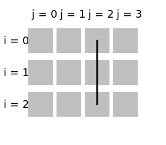

# fix

Set the [index](../Glossary.md#index) in the specified [dimension](../Glossary.md#dimension) to some fixed number.

```hpp
#include <noarr/structures_extended.hpp>

template<auto Dim, typename T, typename IdxT>
struct noarr::fix_t;

template<auto... Dims>
constexpr proto noarr::fix(auto... indices);

constexpr proto noarr::fix(auto state);
```

(`proto` is an unspecified [proto-structure](../Glossary.md#proto-structure))


## Description

The `fix_t` structure removes dimension `Dim` from structure `T`, replacing its index with a fixed value of type `IdxT`.
The resulting view has a smaller dimensionality: for a matrix, it views just a row/column, for a 3D matrix it views just one 2D layer of it, etc.

The `fix` function can accept a list of dimensions: it will compose multiple `fix_t`s if necessary.
The second overload accepts a [state](../State.md) instead. It fixes all indices available in the state.
See the first section of [Dimension Kinds](../DimensionKinds.md) for the allowed types of `indices` (and `IdxT`).

Note that it is not necessary to use `fix` to pass an index to a structure:
passing it in [state](../State.md) or directly to a [function](../BasicUsage.md#functions) is often sufficient.


## Usage examples

`fix` can be used to select a [sub-structure](../Glossary.md#sub-structure) or generally any subset of elements that share the index in a particular dimension.

```cpp
auto matrix = noarr::scalar<float>() ^ noarr::vector<'j'>(4) ^ noarr::vector<'i'>(3);

auto row2 = matrix ^ noarr::fix<'i'>(2);
auto col2 = matrix ^ noarr::fix<'j'>(2);

std::size_t offset_row2_col1 = row2 | noarr::offset<'j'>(1);
std::size_t offset_row1_col2 = col2 | noarr::offset<'i'>(1);

auto struct_of_one_elem = matrix ^ noarr::fix<'i', 'j'>(1, 3);
std::size_t offset_row1_col3 = struct_of_one_elem | noarr::offset();
```

Similarly, `fix` can be used in [`traverser::order()`](../Traverser.md#orderproto-structure-customizing-the-traversal) to limit the traversal to that same subset:

```cpp
// Left image
noarr::traverser(matrix).order(noarr::fix<'i'>(2)).for_each([&](auto state) {
	// Always 2, provided by the `fix` in `order`
	std::size_t i = noarr::get_index<'i'>(state);
	// Different every time, iterated by the traverser
	std::size_t j = noarr::get_index<'j'>(state);

	std::size_t elem_offset = matrix | noarr::offset(state); // Or bag[]
});

// Right image
noarr::traverser(matrix).order(noarr::fix<'j'>(2)).for_each([&](auto state) {
	// j always 2, i distinct
});
```



