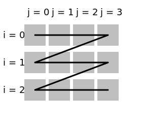
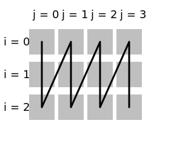

# hoist

Move the specified [dimension](../Glossary.md#dimension) to the top level (for [multidimensional iteration](../Traverser.md)).

```hpp
#include <noarr/structures_extended.hpp>

template<auto Dim, typename T>
struct noarr::hoist_t;

template<auto Dim>
constexpr proto noarr::hoist();
```

(`proto` is an unspecified [proto-structure](../Glossary.md#proto-structure))


## Description

A structure of type `hoist_t` has the same properties as its sub-structure `T`, except that `Dim` appears on the top.
The layout is the same and offsets of individual elements are computed in the same way.
The only difference between `T` and `hoist_t<Dim, T>` is how it appears from outside,
which has an effect on the preferred [traversal](../Traverser.md) order.
In case of single-threaded traversal, the hoisted dimension (`Dim`) will be iterated in the outer-most loop.
In case of parallelization, the hoisted dimension will be the one according to which the structure is split.


## Usage examples

Some constructs accept an exact list of dimensions (e.g. [`traverser::for_dims`](../Traverser.md#for_dimslambda)),
others do not (e.g. [`traverser::for_each`](../Traverser.md#for_eachlambda)).
When a combination of both approaches is needed (i.e. reordering some dimensions and leaving others in-order),
or if you want to split the iteration logic from the logic that chooses the dimensions,
you can use the second kind (`for_each`-like) in combination with `noarr::hoist`.

```cpp
auto matrix = noarr::scalar<float>() ^ noarr::vector<'j'>(4) ^ noarr::vector<'i'>(3);

// Various ways to do a i-major traversal (row-by-row if i is row index)

noarr::traverser(matrix)
	.for_each([](auto inner_trav) { /* ... */ }); // The default with the current definition

noarr::traverser(matrix)
	.template for_dims<'i', 'j'>([](auto inner_trav) { /* ... */ });

noarr::traverser(matrix)
	.order(noarr::hoist<'i'>())
	.for_each([](auto inner_trav) { /* ... */ });

noarr::traverser(matrix ^ noarr::hoist<'i'>())
	.for_each([](auto inner_trav) { /* ... */ });

// Various ways to do a j-major traversal (column-by-column if i is row index)

noarr::traverser(matrix)
	.template for_dims<'j', 'i'>([](auto inner_trav) { /* ... */ });

noarr::traverser(matrix)
	.order(noarr::hoist<'j'>())
	.for_each([](auto inner_trav) { /* ... */ });

noarr::traverser(matrix ^ noarr::hoist<'j'>())
	.for_each([](auto inner_trav) { /* ... */ });
```

The first four examples are represented by the picture on the left, last three on the right:




See [`noarr::into_blocks` examples](into_blocks.md#usage-examples) for more advanced usages.
