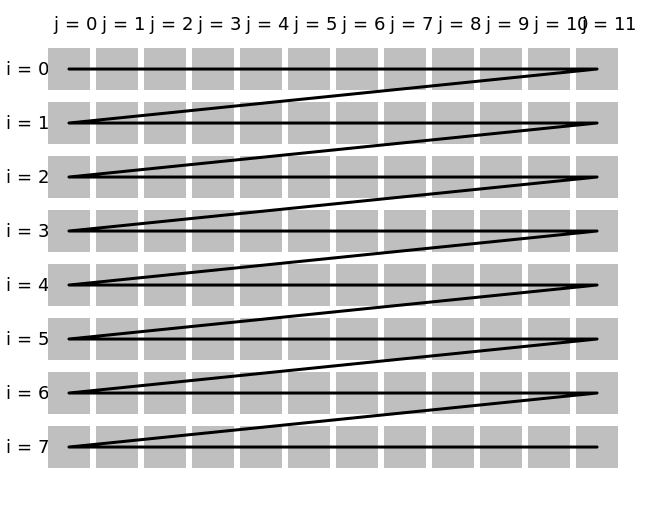
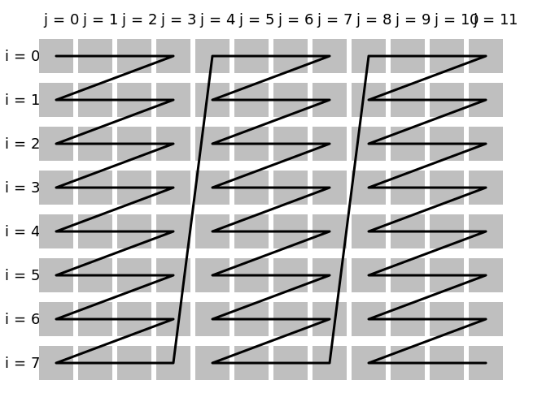
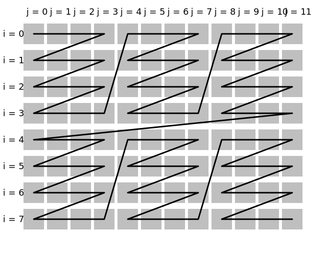

# into_blocks

Split the structure into blocks according to the specified [dimension](../Glossary.md#dimension).

```hpp
#include <noarr/structures_extended.hpp>

template<char Dim, char DimMajor, char DimMinor, typename T>
struct noarr::into_blocks_t;

template<char Dim, char DimMajor, char DimMinor, char DimIsPresent, typename T>
struct noarr::into_blocks_dynamic_t;

template<char Dim, char DimIsBorder, char DimMajor, char DimMinor, typename T, typename MinorLenT>
struct noarr::into_blocks_static_t;

template<char Dim, char DimMajor, char DimMinor>
constexpr proto noarr::into_blocks();

template<char Dim, char DimMajor, char DimMinor>
constexpr proto noarr::into_blocks(auto minor_length);
// = noarr::into_blocks<Dim, DimMajor, DimMinor>() ^ noarr::set_length<DimMinor>(minor_length)

template<char Dim, char DimMajor, char DimMinor, char DimIsPresent>
constexpr proto noarr::into_blocks_dynamic();

template<char Dim, char DimMajor, char DimMinor, char DimIsPresent>
constexpr proto noarr::into_blocks_dynamic(auto minor_length);
// = noarr::into_blocks_dynamic<Dim, DimMajor, DimMinor, DimIsPresent>() ^ noarr::set_length<DimMinor>(minor_length)

template<char Dim, char DimIsBorder, char DimMajor, char DimMinor>
constexpr proto noarr::into_blocks_static(auto minor_length);
```

(`proto` is an unspecified [proto-structure](../Glossary.md#proto-structure))


## Description

The simplest of these structures, `into_blocks_t` takes an existing dimension `Dim` of structure `T` and replaces it with a pair of dimensions, `DimMajor` and `DimMinor`.
The meaning of the new dimensions can then be summarized as follows:

- the [length](../Glossary.md#length) in `DimMajor` is the number of blocks
- the length in `DimMinor` is the block size (element count in one block)
- the [index](../Glossary.md#index) in `DimMajor` is the block index
- the index in `DimMinor` is the element index within the current block
- the index in the original `Dim` is computed as: index in `DimMajor` · length in `DimMinor` + index in `DimMinor`

By default, the block size (length in `DimMinor`) is not known and must be [set externally](../BasicUsage.md#lengths).
However, there are shortcuts that take a `minor_length` parameter.
See the first section of [Dimension Kinds](../DimensionKinds.md) for the allowed types of `minor_length`.

Note that the memory layout is not modified - only the view is changed.
Also note that `into_blocks_t` assumes the original length is a multiple of block size.
If that is not true, you should use `into_blocks_static_t` or `into_blocks_dynamic_t`.
These two handle incomplete blocks in two different ways.

### into_blocks_static

`into_blocks_static_t` first splits the structure in a "body" and a "border".
The length of body will be the largest multiple of block size that is not greater than the length in `Dim`.
In other words, it will be the original length, floored to the block size.
The remaining elements go to the border, so the border size is always (strictly) less than block size (and may be zero).
The border size is computed as the original length modulo block size.

A new dimension is added: `DimIsBorder`. This new dimension always has length `2` (thus the only valid indices are `0` and `1`).
Its index acts as a boolean flag: it is `0` in the body and `1` in the border.

*Only then*, the splitting into blocks is done on the body, as in `into_blocks_t`, that is, `Dim` is split into `DimMajor` and `DimMinor`.

For consistency, the same split is also done in the border. `DimMajor` has length `1` (the only valid index is `0`)
`DimMinor` has the length set according to the border size (and as such may be empty).

Unlike `into_blocks_t` and `into_blocks_dynamic_t`, the block size in `into_blocks_static_t` must be given immediately.

### into_blocks_dynamic

`into_blocks_dynamic_t` takes the opposite approach. It starts by splitting into blocks. It allows the last block to be incomplete.
However, to maintain constant block size (which is the main reason for using blocks in the first place), it makes the last block contain "too many" elements.

To avoid having elements that point past the allocated memory or into an unrelated piece of the structure, the `DimIsPresent` dimension is added.
Normally, the dimension has size `1`, meaning its only valid index is `0`. This is true in all elements of all complete blocks.
It is also true in some elements of the last block, namely those that still "fit" into the original length.
However, if there are any elements that would be past the original length, their `DimIsPresent` will be empty (i.e. length `0` and no valid index).

In case the original length is, in fact, a multiple of block size, all blocks will be complete and `DimIsPresent` will always be non-empty (unit).

### Comparison

`into_blocks` is the easiest to work with and also potentially the most efficient. If you can pad your structure to fit the block size you want to use, we recommend to do so.

Both `into_blocks_static` and `into_blocks_dynamic` impose some restrictions on how the dimensions can be used:

- `DimIsBorder` in `into_blocks_static` is a [tuple-like dimension](../DimensionKinds.md): it cannot be indexed using plain integers.
  `lit<0>` and `lit<1>` must be used instead. [Traverser](../Traverser.md) is able to detect this and use the proper indexing, but it won't allow some operations.
  Also, the `DimMajor` and `DimMinor` dimensions cannot be directly used (e.g. queried for length) before `DimIsBorder` is fixed.
- `DimIsPresent` in `into_blocks_dynamic`, on the other hand, cannot be queried for length until both `DimMajor` and `DimMinor` are fixed.
  Again, this does not pose a problem for traverser, except for example when one attempts to iterate `DimIsPresent` first.

Both also incur some overhead:

- When a traverser encounters a tuple-like dimension, as in `into_blocks_static`, it is forced to specialize the lambda for all possible indices.
  In this case, there will be two specializations, one for the body, one for the border. Note that the number of specializations doubles with each layer of `into_blocks_static`.
  Even if the dimension is used manually, without a traverser, such specialization is usually the only option to access both the body and the border in an algorithm.
- When using `into_blocks_dynamic` on a CPU, it should never be done in the innermost loop. In other words, there should always be at least one dimension below `DimIsPresent`.
  (`DimMajor` and `DimMinor` cannot be used for this because they are dependencies for `DimIsPresent`.)
  If you don't ensure this, there will be a conditional statement in each iteration of the inner loop, leading to missed optimizations, especially vectorization.
  On GPU, `into_blocks_dynamic` is the recommend option: `DimMajor` and `DimMinor` can be [bound to cpu threads](../Traverser.md#cuda-integration) and `DimIsPresent` checked inside the kernel.

Note that the order of dimensions in the two structures is different: this reflects the fact that the dependencies go in opposite ways
(`DimMajor` and `DimMinor` depend on `DimIsBorder`, while `DimIsPresent` depends on `DimMajor` and `DimMinor`).

### general notes

Unless `hoist` or some other kind of transformation is used, `into_blocks` and similar are **extremely unlikely to improve performance on their own**,
since they do not change the access patterns, faciliate vectorization, or explicitly allow bulk processing.
They are just tools to organize and relabel the data so that other tools (e.g. `hoist` or [cuda integration](../Traverser.md#cuda-integration)) can be instructed what to do.


## Usage examples

Most importantly, these structures can be used to change the order of traversal (strip mining, tiling).
The best order always depends on the algorithm and the structure. These examples only show the syntax, not the use cases.
The examples use the following definition:

```cpp
auto matrix = noarr::scalar<float>() ^ noarr::vector<'j'>(12) ^ noarr::vector<'i'>(8);
```

### Default traversal

The traversal in any of the following will be the same:

```cpp
// the default order
noarr::traverser(matrix).for_each([&](auto state) {
	std::size_t off = matrix | noarr::offset(state); // or use bag
	// ...
});

// any combination of blocks
noarr::traverser(matrix).order(noarr::into_blocks<'i', 'I', 'i'>(4)).for_each(/*...*/);
noarr::traverser(matrix).order(noarr::into_blocks<'j', 'J', 'j'>(4)).for_each(/*...*/);
noarr::traverser(matrix).order(noarr::into_blocks<'i', 'I', 'i'>(4) ^ noarr::into_blocks<'j', 'J', 'j'>(4)).for_each(/*...*/);
noarr::traverser(matrix).order(noarr::into_blocks<'j', 'J', 'j'>(4) ^ noarr::into_blocks<'i', 'I', 'i'>(4)).for_each(/*...*/);
```



### Tiling in one dimension

We can split the inner dimension into blocks and then hoist the block index so that it is traversed first:

```cpp
auto tile_j = noarr::into_blocks<'j', 'J', 'j'>(4) ^ noarr::hoist<'J'>();

noarr::traverser(matrix).order(tile_j).for_each([&](auto state) {
	std::size_t off = matrix | noarr::offset(state); // or use bag
	// ...
});
```



What happened here is that:
- the original structure had dimensions `'i'`, `'j'`
- `into_blocks` split `'j'` into blocks, yielding a structure with `'i'`, `'J'`, `'j'`
- `hoist` changed the order to `'J'`, `'i'`, `'j'`

### Tiling in both dimensions

It is possible to split both dimensions to achieve true tiling:

```cpp
auto tile_j = noarr::into_blocks<'j', 'J', 'j'>(4) ^ noarr::hoist<'J'>();
auto tile_i = noarr::into_blocks<'i', 'I', 'i'>(4) ^ noarr::hoist<'I'>();

noarr::traverser(matrix).order(tile_j ^ tile_i).for_each([&](auto state) {
	std::size_t off = matrix | noarr::offset(state); // or use bag
	// ...
});
```



What happened here is that:
- the original structure had dimensions `'i'`, `'j'`
- `into_blocks` split `'j'` into blocks, yielding a structure with `'i'`, `'J'`, `'j'`
- `hoist` changed the order to `'J'`, `'i'`, `'j'`
- `into_blocks` split `'i'` into blocks, yielding a structure with `'J'`, `'I'`, `'i'`, `'j'`
- `hoist` changed the order to `'I'`, `'J'`, `'i'`, `'j'`

Note that the position of `into_blocks` with respect to the others is insignificant (all that is needed is that a dimension is created before it is hoisted).
However, the order of `hoist` is significant. For example, if we first hoisted `'I'`, then `'J'`, the result would have `'J'` as the top-most dimension.

### Parallelization

Apart from improving access patterns, `into_blocks` can also be used for parallelization on both CPU and GPU.
See [traverser CUDA integration](../Traverser.md#cuda-integration) for the GPU case (where it is used to set block dimensions).

To split the computation between multiple CPUs/threads, you will usually use [`noarr::slice`](slice.md).

This example will be about vectorization. Consider a the following example, where we naively sum the elements of an array:

```cpp
auto input = noarr::make_bag(noarr::scalar<float>() ^ noarr::vector<'i'>(num_elems), input_data);

float sum = 0;

noarr::traverser(input).for_each([&](auto si) {
	sum += input[si];
});
```

The compiler will generally not vectorize this code, since each partial sum depends on the previous (and reordering the elements would change the meaning).
If we want to make full use of the vector unit, we need multiple partial sums (a vector of them),
read input in blocks of the same size, and always add a whole block to the vector of sums:

```cpp
// assuming avx512: 16 elems * 32 bits per elem = 512 bits (it is generally ok to overshoot)
constexpr std::size_t block_size = 16;

auto input = noarr::make_bag(noarr::scalar<float>() ^ noarr::vector<'i'>(num_elems), input_data);

auto sums = noarr::make_bag(noarr::scalar<float>() ^ noarr::array<'i', block_size>());

noarr::traverser(sums).for_each([&](auto si) {
	sums[si] = 0;
});

// note: we cannot put this into `order()`, since we need
// the state (`sii` below) to really have both 'I' and 'i'
auto input_blocks = input ^ noarr::into_blocks_static<'i', '!', 'I', 'i'>(block_size);

noarr::traverser(input_blocks).for_each([&](auto sii) {
	sums[sii] += input_blocks[sii];
});

float sum = 0;

noarr::traverser(sums).for_each([&](auto si) {
	sum += sums[si];
});
```
