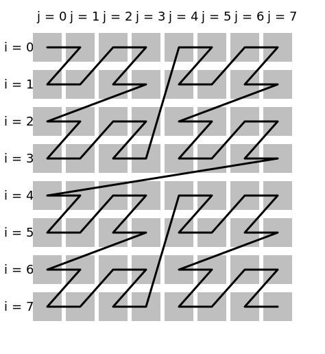
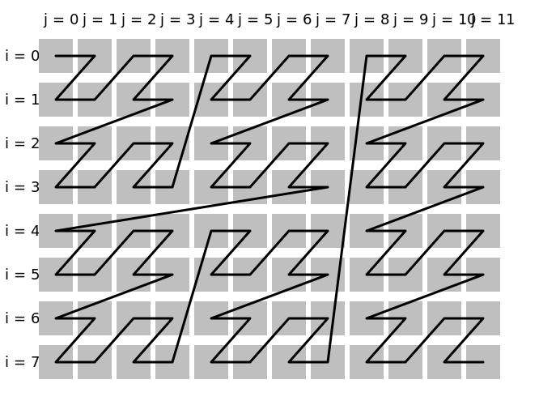
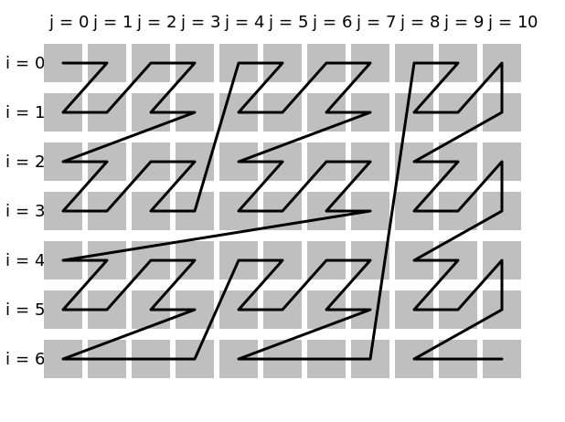
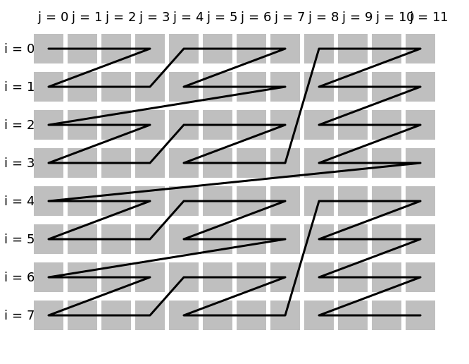

# merge_zcurve

Merge the specified [dimensions](../Glossary.md#dimension) into one dimension
which walks the original dimensions in the [Z-order curve](https://en.wikipedia.org/wiki/Z-order_curve).

```hpp
#include <noarr/structures/structs/zcurve.hpp>

template<auto... Dims, auto Dim>
struct noarr::merge_zcurve {
	template<int MaxLen, int Alignment>
	constexpr proto maxlen_alignment();
};
```

(`proto` is an unspecified [proto-structure](../Glossary.md#proto-structure))


## Description

This structure folds several (usually two or three) dimensions of the original structure (`Dims`) into one dimension (`Dim`).
As such, the original `Dims` are missing from the newly created structure, they are replaced with `Dim`.

As always, the resulting dimension does not contain any gaps (and its [length](../Glossary.md#length) is the product of lengths in all `Dims`).
Although the Z-order curve is usually defined only for dimensions of the same length (which must additionally be a power of two),
this structure lifts this restriction: the `Dims` can be of any lengths.

This however complicates the algorithm, which could negatively impact the performance.
If you know in advance that the lengths of all `Dims` are powers of two (or at least multiples of some power of two other than one),
you can adjust the parameters to use a more efficient (and less general) algorithm. Likewise if the length has an upper bound.

The `MaxLen` parameter is the maximum length in the longest of `Dims`.
Set it to `1 << (SIZE_WIDTH - 1)` if you cannot promise any bound (this is half the range of `size_t`; `merge_zcurve` does not support more).
This parameter must be a power of two -- if the maximum length is not, use the next *larger* power of two.

Set the `Alignment` parameter to the largest power of two such that all the lengths in all `Dims` will always be multiples of `Alignment`.
If you cannot promise any bound, set this to one (since all integers are divisible by one).
If you know that the length will always be a power of two (just don't know which one), set this to the same value as `MaxLen`.


## Usage examples

This structure is intended to guide [traversals](../Traverser.md) of the usual multidimensional structures (e.g. row-major or column-major).
This means it is suitable for the implementation of cache-oblivious algorithms such as those for matrix transposition or multiplication.
It cannot be used to store multidimensional into memory using z-order curve (as is sometimes done e.g. with textures or volumetric data).
For that, an opposite of `merge_zcurve` would be necessary: ~~`into_zcurve`~~, which as of now is not implemented.
Alternatively, you can use a tiled format, created using [`noarr::merge_blocks`](merge_blocks.md).

### Simplest example

If the structure is known and it is a square (or (hyper-)cube) and its lengths are a power of two, the traversal can look like this:

```cpp
auto matrix = noarr::scalar<float>() ^ noarr::vector<'j'>(8) ^ noarr::vector<'i'>(8);

noarr::traverser(matrix).order(noarr::merge_zcurve<'i', 'j', 'z'>::maxlen_alignment<8, 8>()).for_each([&](auto state) {
	// state has 'i' and 'j', can be used with `matrix` (or a bag of it)
	std::size_t off = matrix | noarr::offset(state);
	// ...
});
```



### Rectangle divisible by a power of two

Consider the following structure (used in many other examples):

```cpp
auto matrix = noarr::scalar<float>() ^ noarr::vector<'j'>(12) ^ noarr::vector<'i'>(8);
```

Note that both its lengths are divisible by 4 (this is the largest such power of two).
The maximum length (12) is not a power of two, so we find the smallest next power of two, which is 16.

```cpp
noarr::traverser(matrix).order(noarr::merge_zcurve<'i', 'j', 'z'>::maxlen_alignment<16, 4>()).for_each([&](auto state) {
	// ...
});
```



### The general case

If the upper bound or the divisibility (or neither) is not know, you can use one (or both) of the following parameters:

- `Alignment = 1` - all possible lengths are divisible by 1, and 1 is a power of two
- `MaxLen = 1 + (~std::size_t(0) >> 1)` largest representable power of two, `2**63` on 64bit platforms

```cpp
constexpr std::size_t max_len = 1 + (~std::size_t(0) >> 1);

noarr::traverser(matrix).order(noarr::merge_zcurve<'i', 'j', 'z'>::maxlen_alignment<max_len, 1>()).for_each([&](auto state) {
	// ...
});
```



### Practical usage note

Unless your algorithm depends on it functionally, you should not use `merge_zcurve` all the way down to the individual elements.
Instead, split the structure [into blocks](into_blocks.md) and only use `merge_zcurve` on the block index (`DimMajor`),
leaving the element index (`DimMinor`) "untangled":

```cpp
auto matrix = noarr::scalar<float>() ^ noarr::vector<'j'>(12) ^ noarr::vector<'i'>(8);

noarr::traverser(matrix).order(noarr::into_blocks<'j', 'J', 'j'>(4) ^ noarr::merge_zcurve<'J', 'i', 'z'>::maxlen_alignment<8, 1>()).for_each([&](auto state) {
	// ...
});
```



In the above example, we used blocks of 4 columns and only used the block index (together with row index) for the zcurve.
We also swapped the coordinates of the zcurve, so that it does not double the block size by starting row-wise.
A larger block size may be more useful (depending on algorithm and hardware), 4 is just to make the diagram small enough.
