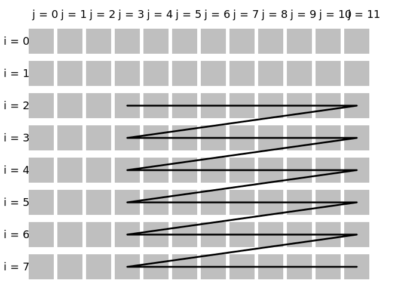

# shift

Shift the [index](../Glossary.md#index) in the specified [dimension](../Glossary.md#dimension) by some fixed nonnegative number (thus skipping some leading elements).

```hpp
#include <noarr/structures_extended.hpp>

template<auto Dim, typename T, typename DeltaT>
struct noarr::shift_t;

template<auto... Dims>
constexpr proto noarr::shift(auto... deltas);
```

(`proto` is an unspecified [proto-structure](../Glossary.md#proto-structure))


## Description

A `shift_t` structure is similar to its wrapped `T` structure, except that it may be shorter in dimension `Dim`.
Some leading elements are omitted from the resulting view. The number of omitted elements depends on the specified delta.
The length of the new structure in `Dim` is shortened by the delta (the starting point).
The new [indices](../Glossary.md#index) run from 0 (inclusive) to the new length (exclusive), as always.
Each element will obtain an index shifted by the constant offset: new index = old index − delta.

Note that the memory layout is not modified -- only the view is changed.

The `shift` function can accept a list of dimensions: it will compose multiple `shift_t`s if necessary.

Shifting a dimension is similar to [slicing](slice.md) it, except that only the starting element is shifted, while the last element stays the same.

It is possible to shift by 0 (yielding a structure equivalent to the original), or by the full length (yielding a structure with no accessible elements).
The delta is an unsigned integer: it is not possible to shift by a negative number.
Shifting with number large enough and indexing with indices large enough to cause wraparound is undefined by noarr and can in some cases result in undefined behavior.

See the first section of [Dimension Kinds](../DimensionKinds.md) for the allowed types of `deltas` (and `DeltaT`).


## Usage examples

`noarr::shift` is similar to [`noarr::slice`](slice.md). For example, the following two are equivalent:

```cpp
auto structure = noarr::scalar<float>() ^ noarr::vector<'i'>(42);

auto shifted = structure ^ noarr::shift<'i'>(10);
auto sliced = structure ^ noarr::slice<'i'>(10, 32); // 32 is the remaining length, 42 - 10
```

In contrast to `slice`, `shift` can also have its length set externally:

```cpp
auto structure = noarr::scalar<float>() ^ noarr::vector<'i'>();

auto shifted = structure ^ noarr::shift<'i'>(10);

auto updated = shifted ^ noarr::set_length<'i'>(32); // this sets the length after shifting

// the length of the vector includes the shift, and thus so does the size
auto size = updated | noarr::get_size();
assert(size == 42 * sizeof(float));
```

It is possible to shift multiple dimensions at once:

```cpp
auto matrix = noarr::scalar<float>() ^ noarr::vector<'j'>(12) ^ noarr::vector<'i'>(8);

auto submatrix = matrix ^ noarr::shift<'j', 'i'>(3, 2);
```

Both `shift` and `slice` can also be used in [`traverser::order()`](../Traverser.md#orderproto-structure-customizing-the-traversal) to limit the traversal:

```cpp
noarr::traverser(matrix).order(noarr::shift<'j', 'i'>(3, 2)).for_each([&](auto state) {
	// the indices here are already shifted
	auto [i, j] = noarr::get_indices<'i', 'j'>(state);
	assert(j >= 3 && i >= 2 && j < 12 && i < 8);

	// use it directly with the original structure (or bag)
	std::size_t off = matrix | noarr::offset(state);
});
```


