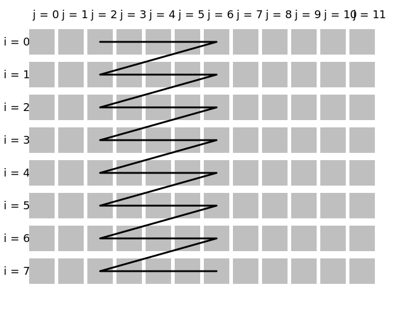

# slice

Slice the structure in the specified [dimension](../Glossary.md#dimension) (thus skipping some leading and some trailing elements).

```hpp
#include <noarr/structures_extended.hpp>

template<char Dim, typename T, typename StartT, typename LenT>
struct noarr::slice_t;

template<char Dim>
constexpr proto noarr::slice(auto start, auto length);
```

(`proto` is an unspecified [proto-structure](../Glossary.md#proto-structure))


## Description

A `slice_t` structure is similar to its wrapped `T` structure, except that it may be shorter in dimension `Dim`.
Some leading elements and some trailing elements are omitted from the resulting view. The number of omitted elements depends on the specified delta.
The length of the new structure in `Dim` is specified by the second parameter.
The new [indices](../Glossary.md#index) run from 0 (inclusive) to the new length (exclusive), as always.
Each element will obtain an index shifted by the constant offset: new index = old index − starting point.

*The second parameter is the length, not the end index.* This is to allow the length to be constexpr (see below) even if the starting point is not.

Note that the memory layout is not modified -- only the view is changed.

The `slice` function creates a proto-structure for `slice_t`.

It is possible, for example, to slice out an empty range (`length = 0`) or the whole structure (`start = 0`, `length = *the original length*`).
However, `start` must be an unsigned number and `start + length` must be less than or equal to the original size (using unsigned wraparound is not allowed here).

If you need a single-ended slice (i.e. change the beginning but leave the end unchanged), use [`noarr::shift`](shift.md).

See the first section of [Dimension Kinds](../DimensionKinds.md) for the allowed types of `start` and `length` (and `StartT` and `LenT` respectively).


## Usage examples

Slicing can be used to limit the view of a structure:

```cpp
auto matrix = noarr::scalar<float>() ^ noarr::sized_vector<'j'>(12) ^ noarr::sized_vector<'i'>(8);

// get the submatrix consisting of cols with j in {2, 3, 4, 5, 6}
auto submatrix1 = matrix ^ noarr::slice<'j'>(2, 5);
// get the submatrix consisting of rows with i in {2, 3, 4, 5, 6}
auto submatrix2 = matrix ^ noarr::slice<'i'>(2, 5);
```

Similarly, it can be used to limit a traversal to the same submatrix:

```cpp
noarr::traverser(matrix).order(noarr::slice<'j'>(2, 5)).for_each([&](auto state) {
	// the indices here are already shifted
	auto [i, j] = noarr::get_indices<'i', 'j'>(state);
	assert(j >= 2 && j < 7);

	// use it directly with the original structure (or bag)
	std::size_t off = matrix | noarr::offset(state);
});
```



```cpp
noarr::traverser(matrix).order(noarr::slice<'i'>(2, 5)).for_each([&](auto state) {
	// same as above, but assert(i >= 2 && i < 7)
});
```


### In data modeling

Slicing can also be used as a step in data modeling, to create padding.
For example, if we want each row of a matrix to contain a multiple of 16 elements, we could do something like this:

```cpp
std::size_t alignment = 16;

std::size_t num_rows = 42;
std::size_t num_cols = 100; // row size not a multiple of 16

// round up (also known as ceiling), some bit-twiddling hacks are also available
std::size_t num_cols_padded = (num_cols + alignment - 1) / alignment * alignment;

// i is row index, j is column index
auto matrix = noarr::scalar<float>()
	^ noarr::sized_vector<'j'>(num_cols_padded)
	^ noarr::sized_vector<'i'>(num_rows)
	^ noarr::slice<'j'>(0, num_cols);
```

Note that it is not necessary that `sized_vector<'i'>` comes before the slice. Slicing only sets the view, but the size is already set.
Therefore, the above example is equivalent to the following:

```cpp
auto matrix = noarr::scalar<float>()
	^ noarr::sized_vector<'j'>(num_cols_padded)
	^ noarr::slice<'j'>(0, num_cols)
	^ noarr::sized_vector<'i'>(num_rows);
```

We could even introduce a proto-structure for it:

```cpp
template<char Dim>
auto my_padded_vector(auto len, auto a) {
	return noarr::sized_vector<Dim>((len + a - 1) / a * a) ^ noarr::slice<Dim>(lit<0>, len);
}

auto matrix = noarr::scalar<float>()
	^ my_padded_vector<'j'>(100, 16)
	^ noarr::sized_vector<'i'>(42);
```

See also [incomplete blocks example in the `merge_blocks` documentation](merge_blocks.md#incomplete-blocks).
