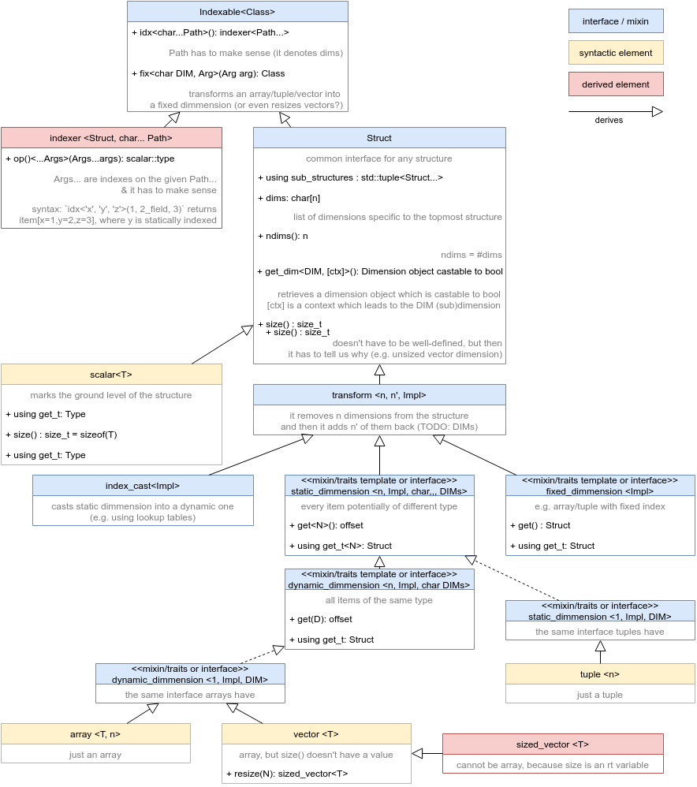

# Prototype overview

> Jirka M, trying to make sense of this. Refine this document as you wish.

> In chronological order, I think.

There are two lines of development: `arrr` by Mirek and `prototype` by Jirka K.


## `prototype.cpp`

The oldest prototype by Jirka K. It looks at one piece of data through different policies and and can access individual values by providing indices. Does not support axis labeling.

```cpp
char data[256];

using policy1 = array<64, float>;
using policy2 = array<8, array<8, float>>;

std::cout << *policy2::at(data, 1, 0) << std::endl;
```


## `arrr.cpp`

Here we introduce axis labeling.

We define data (a container / a policy, whatever you call it):

```cpp
array<10, array<20,scalar<float>, 'y'>, 'x'> a;
```

We can provide names of dimensions in a given order to receive an object `idx`, that we can further ask for the data by invoking it:

```cpp
auto idx = a.idx<'x', 'y'>();
std::cout << idx(1, 2) << std::endl;
```

**Cons:** Only one scalar value possible. It's basically just a cube with easy axis rotation. Only supports `array` and `vector`, not `tuple`.


## `arrr2.cpp` and `arrr2.hpp`

Improved version of `arrr1`, joining the two concepts into one (getting an indexer `x, y` and indexing `(1, 2)`):

```cpp
cout << a.idx<'y', 'x'>(6, 5) << endl;
```

Also adding the possibility to query indexes:

```cpp
cout << a.has_idxs<'x', 'y'>() << endl;
```

And the ability to create a new container by resizing the old one at a dimension:

```cpp
auto as = a.resize<'y'>(30);
```

The `.idx<...>(...)` function returns `size_t` - an offset from the begining od the container. There's not a support for proper return types. Tuple is still not present.


## `arrr3.cpp`

Third iteration of the `arrr` code.

Major change: transition to the `%` operator. It has the meaning of a dot `.` but hides some underlying mess:

```cpp
cout << a % idx<'y','x'>(3,5) << endl;
```

Still returns `size_t` - offsets.

Introduces functions for better resizing, fixing dimensions and querying depth.

The diagram applies to this code (I think):




## `prototype2.cpp`

Jirka K vysvětlí. Vidím tady opět použití operátoru `%`. Jak začínám chápat, tak ten operátor jen zavolá můj kontejner (kontejner je zobrazení z indexů do paměti) nad nějakými daty, abych dostal jeden prvek těch dat (takže kontejner je sice třída / struktura, ale chová se jako funkce, protože implementuje invokační operátor). Tak něco...


## My question (Jirka M):

Can't we mash those two approaches together and have something that can both label dimensions and have proper return types when accessing individual elements?
